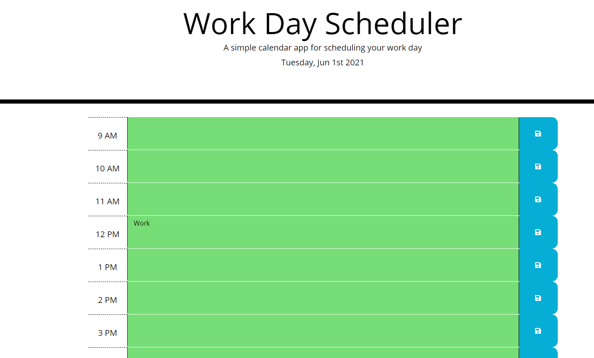

# Day-Planner
## Homework Week 5

===

## Description
This project consists of a Day Planner that dynamically updates HTML and CSS elements using JavaScript.  The page utilizes Moment.js and JQuery libraries to streamline javascript elements.  When the page is loaded, the user is presented with different rows represening each hour of the workday, from 9 AM to 5 PM.  When the current hour passes over one of the hour blocks,  the background color dynamically changes to match if they are now in the past, the present, or the future.  Users are able to enter text into the hour blocks and save them to local storage, so they repopulate the text boxes on page load.  To clear their day and get started on the next day, the user is able to click on the reset button under the current date to clear their schedule.

## Screenshot
Here you can find a mockup screenshot of the webpage, displaying the Day Planner in action:

---

## URL
Web page can be located at [Gitpages](https://mrg105.github.io/Day-Planner/ "Day Planner")

## Repo
Repository can be located at [Github](https://github.com/MrG105/Day-Planner "Github")

## Contact
Javascript code and Repo updated by Gabriel Gutierrez.  [email](poo328@my.utsa.edu "email")